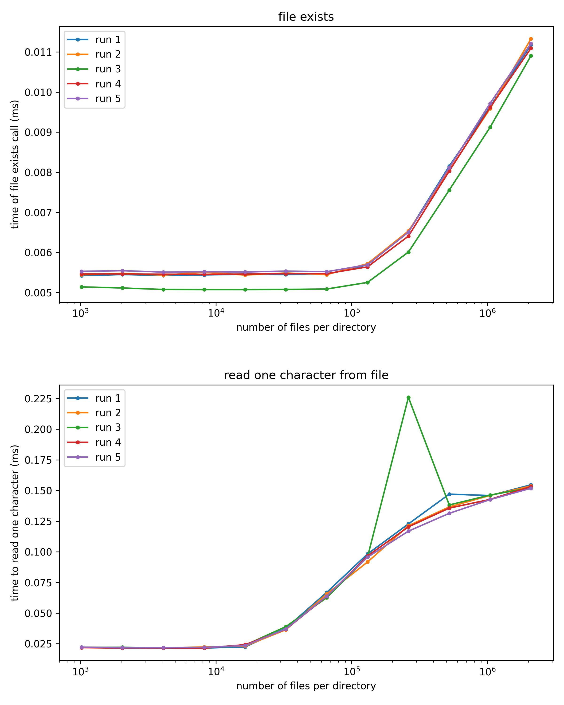

# File Access Time

### Question?

How does the number of files contained in a directory influence the time it takes
to access (find / read) a single file?

### Heuristic Answer

Running the script `test/dev_file_access_time.py` generates directories, where each
directory contains a different number of files.
After that, the time it takes check the existence of a single file is measured.
In addition, the time to read a single character from that file is recorded as well.

The following plot shows such times averaged over many file access and files read 
calls on an ext4 file system (Debian 11). 
The whole benchmark war repeated 5 time.

We conclude, that the time it takes to check the existence of a file remains nearly 
constant up to 2^16 = 65536 files.
In contrast, directories with more than 2^14 = 16384 files slow down the procedure
of reading a single character from a file.
 

 

